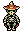
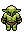
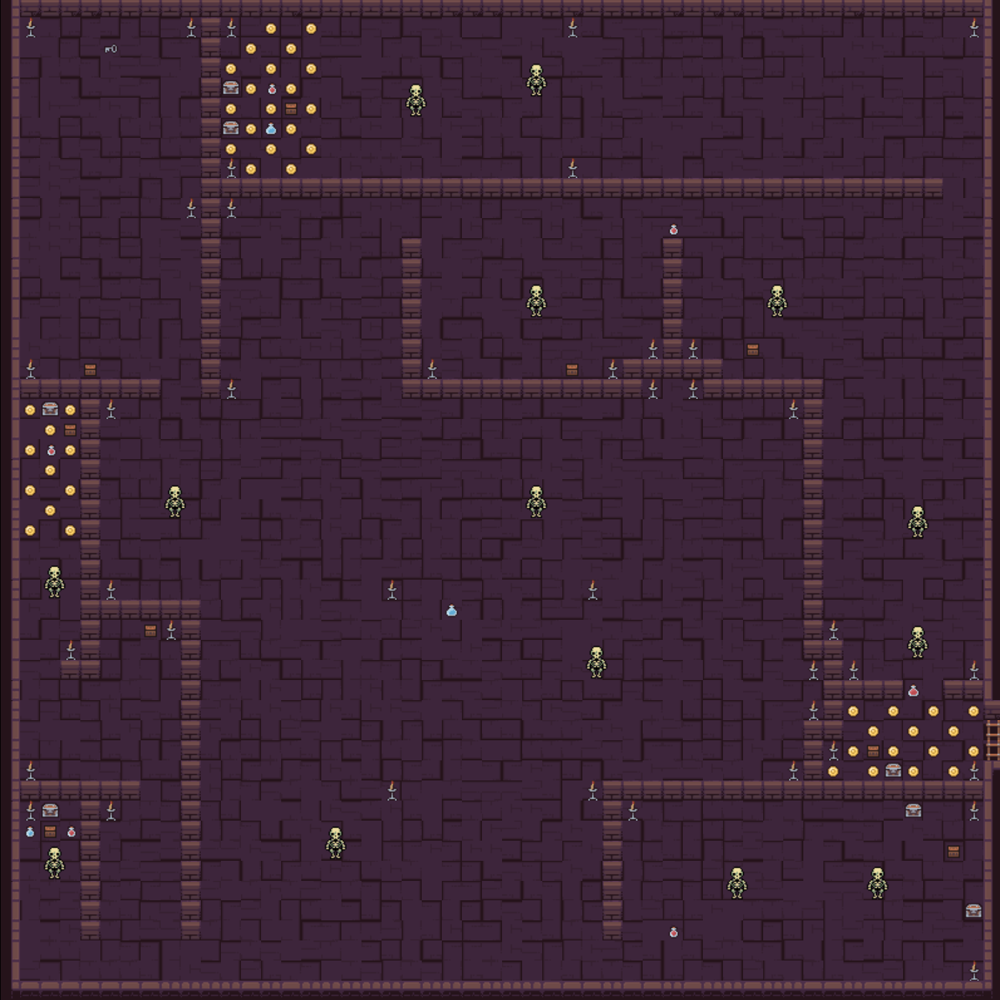
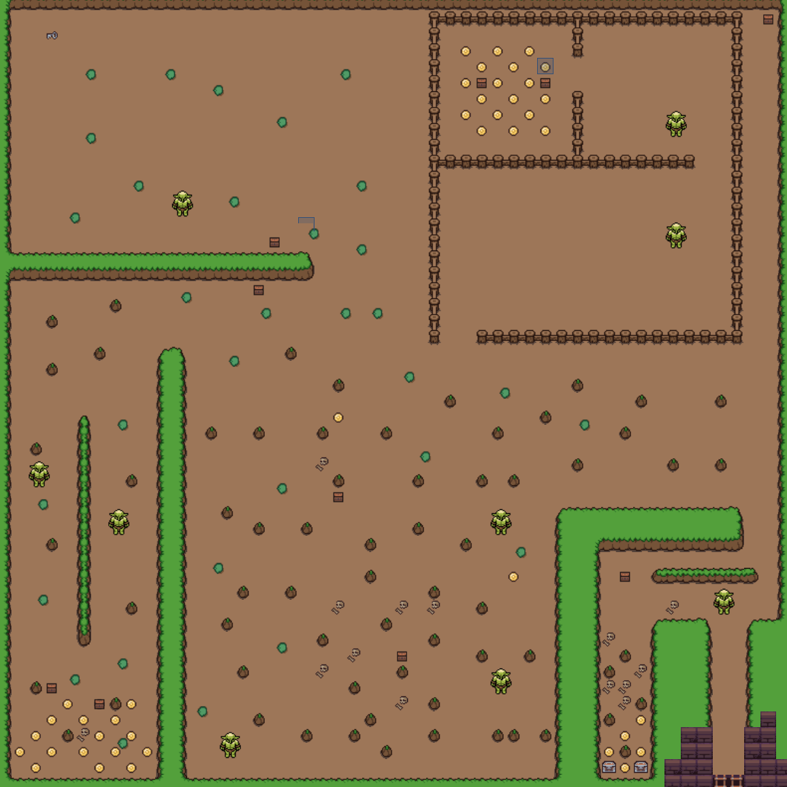

# Handout Team Underwatch

Ein Projekt von Benjamin Bies, Jeremias Wolfs, Jakob Fassunge und Martin Schmidt.

## Statistics of efforts

## Highlights of our Demo

## Highlights of our Project

### Box2D

MARTIN

### Pathfinding

We implemented the logic for the A*-Pathfinding algorithm based on tiled layers in Java.

### CI/CDx

MARTIN

### Artstyle

We decided on two different tilesets for the art style. There should be maps in the dungeon and in the outside world. We used a dark TileSet for the maps in the dungeon and one with rock-like textures for the outside world. 

The enemies are skeletons() and orcs(), but we fight with modern weapons.()

