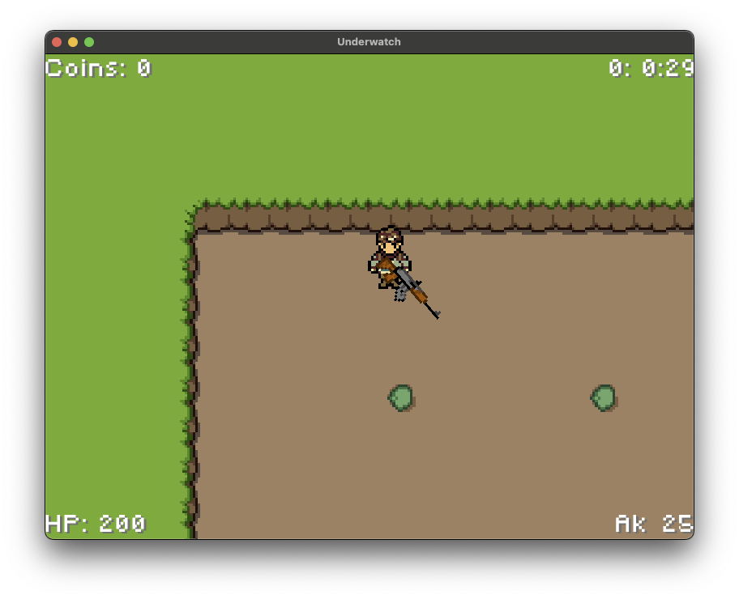
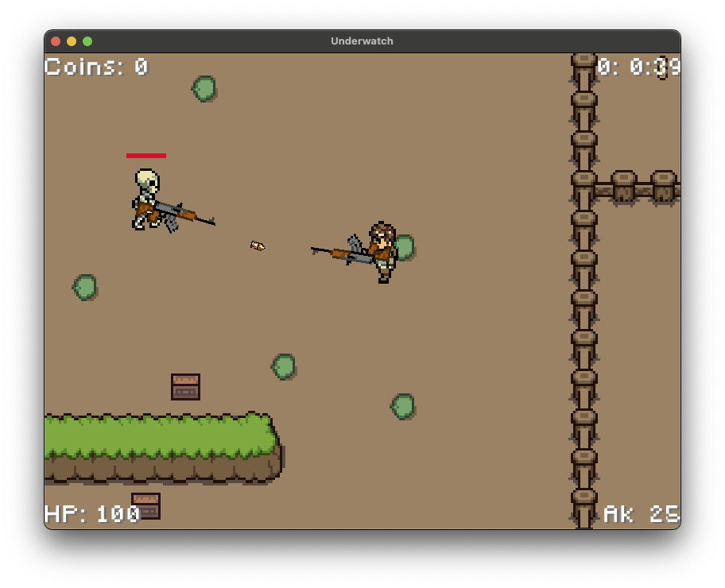
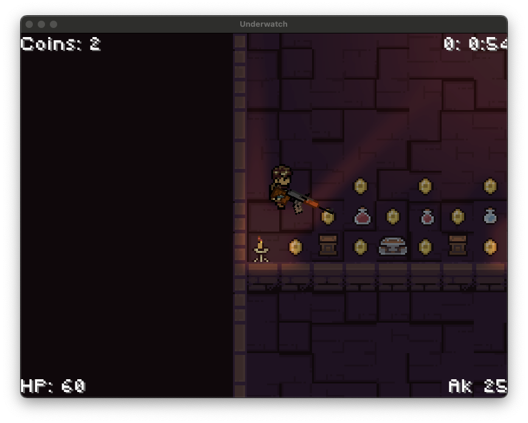
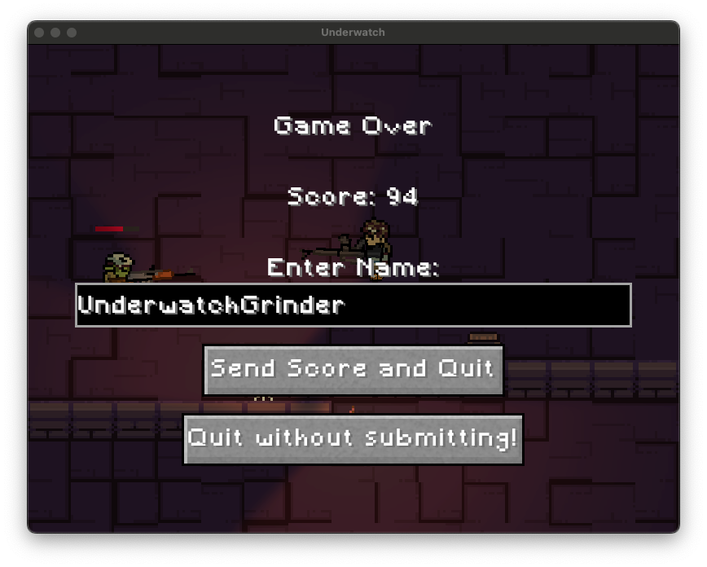
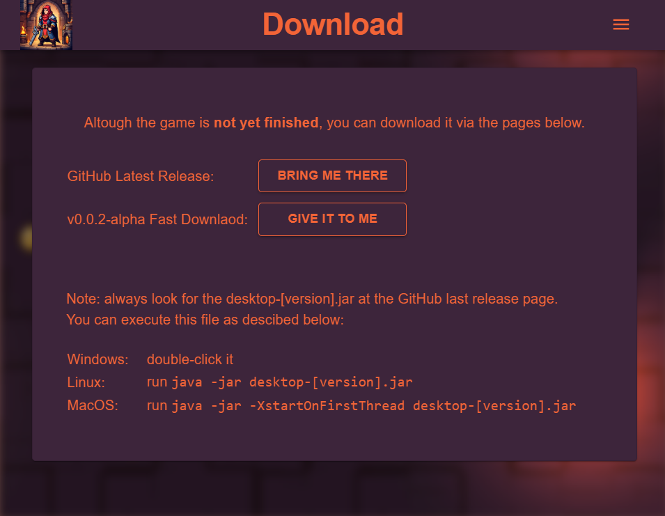
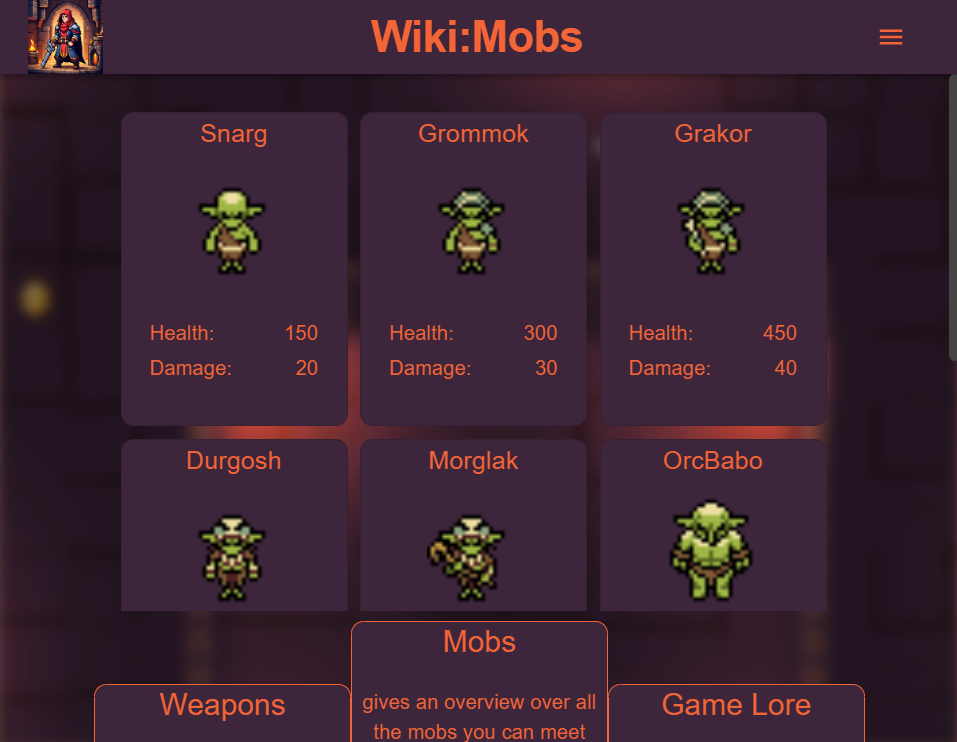
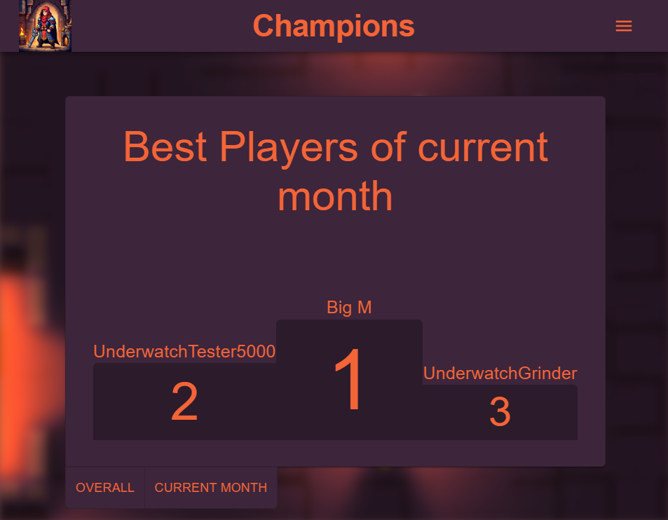
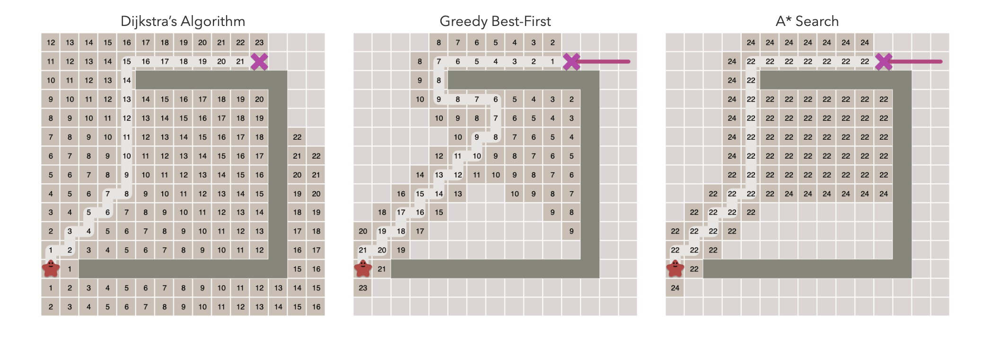

# Handout Team Underwatch

Ein Projekt von Benjamin Bies, Jeremias Wolfs, Jakob Fassunge und Martin Schmidt.

## Statistics of efforts

## Highlights of our Demo

## Highlights of our Project

### Box2D

MARTIN

### Pathfinding

We implemented the logic for the A*-Pathfinding algorithm based on tiled layers in Java.

### CI/CDx

MARTIN

### Artstyle

BENJAMIN

