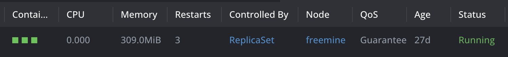
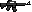

# Handout Team Underwatch

Ein Projekt von Benjamin Bies, Jeremias Wolfs, Jakob Fassunge und Martin Schmidt.

## Statistics of efforts

Oben aufgelistet sind die Arbeitstunden, aufgeschlüsselt nach Teammitglied.

- JAWolfs = Jeremias
- iscodeminister = Ting
- BenjaminB109 = Benjamin
- LPkkjHD = Martin
- dolerich-hirnfiedler = Jakob

## Highlights of our Demo

## Highlights of our Project

- **Box2D**: We use a third party, open-source library which takes care of handling the physics simulation

- **Pathfinding**: We implemented the logic for the A*-Pathfinding algorithm based on tiled layers in Java.

- **CI/CD**: We use GitHub Actions to build our project into docker containers and deploy those with a horizontal autoscaler into a kubernetes cluster.
 

### Artstyle

We decided on two different tilesets for the art style. There should be maps in the dungeon and in the outside world. We used a dark TileSet for the maps in the dungeon and one with rock-like textures for the outside world.

The enemies are skeletons() and orcs(), but we fight with modern weapons.()

