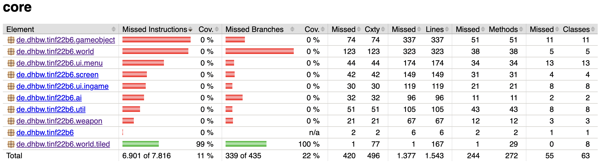
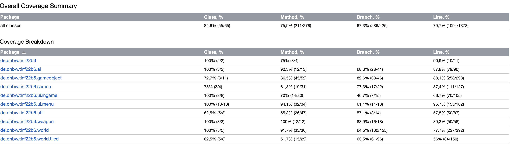

# Underwatch
## Test Report

### 1. Introduction

The Underwatch project is divided into two major and one minor components. Namely:

1. Game (major)
2. Web Page (major)
3. Backend (minor)

We chose this classification since the major business logic of our project is implement in either the web page or the game respectively. 
The Backend merely serves as an mostly auto-generated RESTful API which comes with SpringBoot out of the box.

Each component requires a seperate testing methodology which we are going to break down in this document.

### 2. Test Strategy

#### Backend Tests

As described previously, we are using the SpringBootRest template within our project. They do their very own testing of edge cases and general functionality which you can check out in their [GitHub/Jenkins](https://github.com/spring-projects/spring-data-rest).

Nevertheless we do implement some functionality here which can be easily covered by unit tests.
For the setup we chose the following software testing stack:

- JUnit5
- SpringFramework

By injecting an in-memory database into the framework we're able to insert, modify and delete records in a unit test.

#### Web Page Tests

As the Web Page is a visual representation of code in the browser, unit testing a web page does only provide minimal use. 
However, since we taking advantage of the React Library, which comes with a handy `React Testing Library` we are able to at least test the functionality of components.

To make the web page tests complete, there are manual (integration) tests neccessary, before a build gets deployed to production.

#### Game Tests

Sadly the LibGDX Framework did not come with a proper implementation of a `headless` backend, not allowing us to unit test many components of this subsystem by writing test cases.
Because of this fact our testing strategy for the game was split into two major parts (of which one is quite time-consuming).

Unit tests are created for all statically available code, which has no dependency on a LibGDX (or GPU) backend.

Additionally manual integration testing is conducted extensively before a build is depoloyed.

### 3. Test Plan

We plan on independently testing each of the systems components leading up to a release, where each component has its own release cycle.
For the backend a new version shall be considered `ready for release` when the test suite of unit tests passes.
The web page is tested on the developers machine and the machine of the peer reviewee. Additionally the test suite in the pipeline has to pass before it is considered production ready.

Unit testing for the Game will run on each commit to the repository - requiring the entire suite to pass before a branch may be merged into `main`. Additionally every review and planning (once a week) integration testing with coverage analysis will be run.

### 4. Test Cases

#### Backend

One of the unit tests for the backend looks like this, however, all of the tests follow the same pattern:

```Java
@Autowired
    private ScoreRepository repository;

    @BeforeEach
    void setUp() {
        repository.save(new Score("Schlongus Longus", 999, 10, 5, 5523, 24, new Timestamp(new Date().getTime()), 100L));
    }

    @AfterEach
    void tearDown() {
        repository.deleteAll();
    }

    @Test
    @DisplayName("Name only matches with Full Name")
    void filterQuery() {
        assertEquals(1, repository.filterQuery(0, "s", null, null, null).getTotalElements());
        assertEquals(1, repository.filterQuery(0, "S", null, null, null).getTotalElements());
        assertEquals(1, repository.filterQuery(0, "Schlongus Longus", null, null, null).getTotalElements());
    }
```

Their purpose is to check for edge cases which may happen during the filtering of the repository.

#### Web Page
> Todo @JAWolfs

#### Game

For unit testing there is a similar structure in place as for the backend.

```Java
    @Test
    void getDynamicBodyDef() {
        // check position
        assertEquals(new Vector2(0, 0), WorldParser.getDynamicBodyDef(0, 0).position);
        assertEquals(new Vector2(0, 1), WorldParser.getDynamicBodyDef(0, 1).position);
        assertEquals(new Vector2(1, 0), WorldParser.getDynamicBodyDef(1, 0).position);
        // check wrapper call
        assertEquals(new Vector2(0, 0), WorldParser.getDynamicBodyDef(new Vector2(0, 0)).position);
        assertEquals(new Vector2(0, 1), WorldParser.getDynamicBodyDef(new Vector2(0, 1)).position);
        assertEquals(new Vector2(1, 0), WorldParser.getDynamicBodyDef(new Vector2(1, 0)).position);
        // check body type
        assertEquals(BodyDef.BodyType.DynamicBody, WorldParser.getDynamicBodyDef(0, 0).type);
        assertNotEquals(BodyDef.BodyType.StaticBody, WorldParser.getDynamicBodyDef(0, 0).type);
        assertNotEquals(BodyDef.BodyType.KinematicBody, WorldParser.getDynamicBodyDef(0, 0).type);
    }
```

For the rest of the game we do end to end integration testing with coverage leveraging IntelliJ's capability to do this during run time.

### 5. Test Results 

We didn't find any major defects or bugs which have to be resolved, however in the game we found the expected result of the coverage report. Where the static unit tests cannot cover the main game logic (first picture) whereas the integration test (second picture) takes more time but also covers a satisfactory amount of code.





### 6. Metrics
> This section provides quantitative data on the testing process, such as the number of defects found, the defect resolution time, and the test coverage achieved.
> 
`Depth Inheritance Tree` is a metric which can tell us something about the code reuse within our project. With a higher count being more prone to bugs as well as more logic being reused. According to the tools output we have this metric laying between 1 and 4 which we consider as quite optimal.

`Response for Class` counts the responses a class can generate. Also indexing referenced classes this metric can skyrocket quite quickly. According to research a value between 0-50 is most optimal here. Our calculated rfc lays between 0-42 (with one outlier at 59). This tells us that we're mostly doing good, but should consider refactoring the outlier class.

`Lines of Code` per class tell us something about the complexity of our classes. If this value get's too high we have to consider that we might have created a god class, which is too mighty and often leads to many bugs down the line. According to ck's output we lay between 0-200 which we interpret as being pretty good, since most of the time boilerplate code, such as getters and setters are already eating up a majority of the code lines resulting in the implemented logic being very concise.
### 7. Recommendations

To further improve the quality of the software a proper implementation of `libgdx-headless` would be very helpful, however, in order to create this a major amount of time has to be set aside. This is not feasible, therefore we aim on having all play testers play the game with coverage reporting enabled - allowing us to collect metrics as well as find possible bugs which still remain in the game.

### 8. Conclusion

During the setup of the testing we learned that unit testing plays a major part in todays static quality analysis. Therefore choosing an easily testable framework to integrate the application into become a neccessity. Unfortunately we chose a framework which does not allow us to do so efficiently - leading into us falling back to integration and manual testing to find bugs in our codebase.
