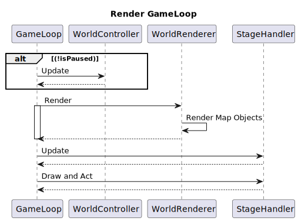
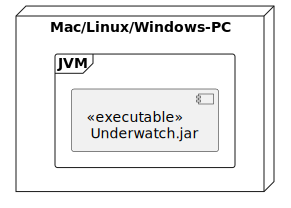
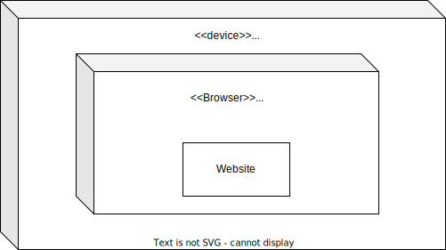

# Underwatch

## Software Architecture Documentation
>
> This template is a simplified version based on the documentation templates from IBM Rational Unified Process (RUP) and arc42.org (<https://docs.arc42.org/home/>)
> If necessary, you can add more topics related to the architecture design of your application.

### 1. Introduction

#### 1.1 Overview

By incorporating the following architectural patterns, our design ensures robust, scalable, and maintainable software that can efficiently support the features and future growth of the project.

1. *Model-View-Controller (MVC):*
   - `Game`: Separates game logic (Model), rendering (View), and user input (Controller), enhancing modularity and maintainability.
   - `Website`: Uses MVC to segregate data handling, UI, and control flow, making it easier to manage and extend.

2. *Client-Server Architecture:*
   - `Backend Integration`: Game acts as the client sending high scores to the server, ensuring a clear division between frontend gameplay and backend data processing.
   - `Scalability`: Enables the backend to scale independently, handling more players and higher loads without modifying the game client.

3. *Layered Architecture:*
   - `Application Layer`: Manages game logic and user input processing.
   - `Data Layer`: Interfaces with backend services and databases for persistent storage and retrieval of high scores.

4. *RESTful Architecture:*
   - `API Design`: Backend provides RESTful APIs for high score data exchange, following standard HTTP methods and stateless operations for simplicity and interoperability.

5. *Service-Oriented Architecture (SOA):*
   - `High Scores Service`: A dedicated service for managing high score data, allowing for independent scaling and updating without impacting other backend components.

6. *Event-Driven Architecture:*
   - `Game Events`: Utilizes event-driven mechanisms for gameplay actions (e.g. input handling or enemy movement), ensuring responsive and decoupled game logic.

7. *Repository Pattern:*
   - `Data Access`: Encapsulates data access logic within repositories, providing a clean separation of data retrieval and manipulation from business logic.

8. *Singleton Pattern:*
   - `Game Manager`: Ensures a single instance of core game management classes, controlling the game’s state and lifecycle uniformly.

#### 1.2 Constraints

#### 1.2.1 Technical Constraints

| Constraint | Background and /or motivation|
|-|-|
|Operating on Linux, Mac, and Windows | We want the largest possible user-base. |
|Implementation in Java and React| We use Java 21 for the game and the backend. Our website is written with React |

#### 1.2.2 Organizational Constraints

| Constraint | Background and /or motivation|
|-|-|
|Team|Martin, Benjamin, Jeremias and Jakob in the current course Tinf22B6|
|Schedule| Start of work with beginning of the third semester. First presentable version at the end of the third semester. Advanced final version at the end of the fourth semester.|
|Development Tools| IDE: bring your own. Diagramms: DrawIO or PlantUML. Versioning: Git. Host: Github|
|Release as Open Source| The code is made available as open source|

#### 1.2.3 Conventions

| Convention | Background and /or motivation|
|-|-|
|Architecture Documentation| We will use the structure according to the lecture Software-Engineering and use the provided templates (sad.md, srs.md, and emmm.org)|

#### 1.3 References

- [Handout, 11.06.2024, Underwatch](Handout.md)
- [Relation among classes, 11.06.2024, Underwatch](Relation%20among%20classes.pdf)
- [Continuous Integration and Continous Deployment, 11.06.2024, Underwatch](CI-CD.md)
- [EMMM Table, 11.06.2024, Underwatch](emmm.org)
- [Software Requirement Specification, 11.06.2024, Underwatch](srs.md)
- [Test Report, 11.06.2024, Underwatch](Test%20Report.md)

### 2. Architecture tactics

Our architectural tactics directly revolve around the non functional quality requirements we set in chapter 3 of the [Software Requirement Specification](srs.md#3-nonfunctional-requirements).

1. **Availability**: We develop system components independently (namely the web page and the backend service) which are packaged into a docker container. This container can be easily monitored by the tools kubernetes provides us with - allowing automatic horizontal scaling as well as load balancing.
2. **Performance**: The performance of the game is directly tied to the post processing effects as well as the physics engine. The physics engine is moreover dependent on the amounts of entities which we store in the `Entity Component System`. We perform load testing (via unit tests and metrics collection) on the game before staging a build to go to release.
3. **Usability**: The usability is directly tied to the ease of configuration in game, as well as in the code of the game. Therefore the `singleton pattern` is a cornerstone to ensure that default configurations, which are used in the entire industry are present in the game.

### 3. Architecture design

#### 3.1 Overview

Our System is split into multiple independently acting subsystems. To make communcation possible we use the `RESTful` architecture style, making use of standard http requests and stateless operations.
In the following diagram you can see the subsystems `Game`, `Web Page` and `Backend`.


The `Backend` is composed of a single component, which holds the data. However it can be easily scaled horizontally to handle many requests concurrently.

The `Web Page` features four different components, two of which need to retrieve data from the `Backend`. They use the `RESTful` endpoints provided by the `Backend` to do this asyncronously. The `Wiki`- as well as the `Download` component serve static content.

The `Game` is where most of the action happens. During the Gameplay the `InputController` handles the input a player gives the program. `PhysicsEngine`, `PostProcessing` and `EntitySystem` control what's on the screen and the `AudioPlayer` provides music for the player to listen to.
The `GameLoop` is responsible for coordinating the PhysicsEngine as well as the EntitySystem as well as the state the game is currently in. Upon finishing a game run this component also establishes a http connection to the `Backend` service upserting the highscore of this run.

#### 3.2 Runtime view (Tips: <https://docs.arc42.org/section-6/>)



- `GameLoop`: The GameLoop is the main loop, which servers as the central unit of the game.
- `GameController`: The Game Controller handles the logic of game objects, such as the player or enemies.
- `WorldRederer`: The world renderer is responsible for drawing the updated graphics with updated informations coming from the `GameController` every 60 seconds
- `StageHandler`: The stage handler is responsible for drawing UI elements on the game screen.

#### 3.3 Deployment view (Tips: <https://docs.arc42.org/section-7/>)

##### 3.3.1 Game



**Software-Dependencies on the PC**

- Java Runtime Environment SE 17 or higher
- JVM has to be on the system's path

`Underwatch.jar` contains the compiled java-sourecode for the game and all dependencies of the game's modules.
The game has to be started from the CLI with the command:

```sh
java -jar Underwatch.jar
```

from inside the directory where `Underwatch.jar` resides.
##### 3.3.2 Backend


##### 3.3.3 Frontend


